[homepage](../index.md)

# STL源码剖析
SGI source code: https://github.com/SilverMaple/STLSourceCodeNote/blob/master/

## Allocator 空间配置器
STL配置器定义于 `<memory>` ，STL allocator将构造/析构与内存分配/释放区分开来，其包含：
- `<stl_alloc.h>` : `alloc::allocate()` 分配内存 | `alloc::deallocate()` 释放内存      //负责内存空间的配置与释放
- `<stl_construct.h>` : `::construct()` | `::destroy()`                                              //*负责对象的构造与析构*
- `<stl_unitialized.h>` 里面包含了一些全局函数, 与**对象初值设置**有关 
	- `un_initialized_copy() | un_initialized_fill() | un_initialized_fill_n()`
	- 这些函数对于效率都有考量
		- **最差**情况下会调用`construct()`
		- **最优**情况会使用**C标准函数`memmove()`直接进行内存数据移动**

### 2.2.3 构造和析构基本工具 `<stl_construct.h>`

```cpp
#include <new.h>

// 构造：只有泛化构造
template <class T1, class T2>
inline void construct(T1 *p, const T2& value) {
    new (p) T1(value); // p =  new T1(value);
}

// 析构
// 泛化析构
template <class ForwardIterator>
inline void destory(ForwardIterator first, ForwardIterator last) {
    typedef typename __type_traits<T>::has_trivial_destructor trivial_destructor; // trivial_destructor : 用来标记析构函数是否为平凡的参数
    __destory_aux(first, last, trivial_destructor());
}

// 上个函数所调用的trivial_destructor()返回__true_type表示为trivial析构，没必要对每一个对象进行无关痛痒的析构，很损耗效率
template <class ForwardIterator>
inline void __destory_aux(ForwardIterator, ForwardIterator, __true_type) {} // 确认所有对象只有trivial析构后，不再一一析构，直接结束

// 若为non-trivial
template <class ForwardIterator>
inline void __destory_aux(ForwardIterator, ForwardIterator, __false_type) {
    for( ; first < last; ++first)
        destory(&*first); // 调用每一个对象的non-trivial析构👇
}

// 特化析构： 用于析构一个对象，活上述接受两个迭代器的destory其中的每一个对象
template <class T>
inline void destory(T* pointer){
    pointer->~T();
}

```
![[Pasted image 20240329174543.png|600]]

> [!Tip] 泛化析构的优势
> 若使用参数为first, end 迭代器的析构函数，万一范围很大，而如果每个对象的析构函数都是无关痛痒的(trivial destructor), 那么一次次调用这些 trivial destructor 对效率是一种伤害。因此先利用 `value_type()` 获得迭代器所指对象的型别，再利用 `__type_traits<T>` 判断是否`trivial`。若是 `__true_type` , 则什么也不做直接结束；若否 `__false_type` , 才循环整个范围，并调用 `destroy()`

> [!note] trivial
> 平凡，意为**该类只有默认构造、析构函数，没有用户自定义构造、析构**，==析构函数不执行任何操作（或者说是无副作用的）==。这个信息对于性能优化是很有用的，因为对于平凡析构函数，我们可以省略显式调用析构函数的步骤，从而提高代码执行效率。


### 2.2.4 空间的配置与释放 std::alloc

>[!Danger] 内存分配注意的问题
>1. 向 system heap 请求空间
>2. 考虑多线程
>3. 内存不足时的应变措施
>4. 考虑过多”小型区块“可能造成的内存碎片问题

#### SGI 双层级配置器
第一级配置器 `malloc()  free()`
第二级配置器:
1. 当配置区块 `> 128 bytes`, 视为"足够大"，调用第一级配置器
2. `< 128 byes` , 视为"过小"，为了降低额外负担，采用复杂的 memory pool。
*整个设计是否只开放第一级配置器，或同时开放第二级配置器，取决于 `__USE_MALLOC` 是否被定义*
![[STL-20240329184439033.webp]]
![[STL-20240329184717314.webp]]

 >[!INFO] C++ new handler
 >当 c++ 的 `new` 或 `new[]` 分配内存失败时:
 >1. 若用户有自定义的函数即 "new handler",系统会调用这个函数**尝试释放内存或进行其他操作**
 >2. 若没有设置新的处理程序，则抛出`std::bad_alloc` 异常
>For example:
```cpp
 #include <iostream>
 #include <new>
 
 void customeNewHandler()
 {
	 std::cerr << "Memory allocation failed! Custom New Handler called" << 
			 std::endl;
	 // free up  memory or other actions
 }

int main()
{
	std::set_new_handler(customNewHandler);
	int* ptr = new int[100000000000000000];
	// Use the allocated memory  ... 

	// Release memory 
	delete[] ptr; 
	return 0;
}
```

#### 第一级配置器 `__malloc_alloc_template`

```cpp
#if 0

#include <new>
#define __THROW_BAD_ALLOC throw bad_alloc

#elif !defined(_THROW_BAD_ALLOC)

#include <iostream>
#define __THROW_BAD_ALLOC cerr << "out of memory" << endl; exit(1)

#endif


template <int inst>
class __malloc_alloc_template{

private:
	// 内存不足时调用
	// oom : out of memory
	static void * oom_malloc(size_t);
	static void * oom_realloc(void *, size_t);
	static void (* __malloc_alloc_oom_handler) ();

public:

	static void * allocate(size_t n)
	{
		void * result = malloc(n);
		// 无法满足需求时，改动oom_malloc()
		if(0 == result) result = oom_malloc(n);
		return result;
	}
	
	static void deallocate(void*p, size_t)
	{
		free(p); // 第一级配置器 直接使用free
	}

	static void * reallocate(void* p, size_t old_sz, size_t new_sz)
	{
		void * result = realloc(p, new_sz);
		// 无法满足需求时，改动oom_realloc()
		if(0 == result) result = oom_realloc(p, new_sz);
	}

	static void (* set_malloc_handler(void (*f)))()
	{
		void (*old) () = __malloc_alloc_oom_handler;
		__malloc_alloc_oom_handler = f;
		return old;
	}
}


void (*__malloc_alloc_template<inst>::__malloc_alloc_oom_handler)() = 0;

template<int inst>
void *__malloc_alloc_template<inst>::oom_malloc(size n)
{
	void (* my_malloc_handler) ();
	void *result;
	for(;;)
	{
		my_malloc_handler = __malloc_alloc_oom_handler;
		if(0 == my_malloc_handler) {__THROW_BAD_ALLOC;}
		result = my_malloc_handler(n);
		if(result) return (result);
	}
}

// oom_realloc(p, n) 同上
```

#### 2.2.6 第二级配置器 __default_alloc_template

```mermaid
---
title: 索求任何一块内存，都要交"税"给系统
---
flowchart LR 
	memory["cookie,用于记录内存大小
	-----------------------------
	object 所需内存
	"]
	pa --> memory
```


##### memory pool ==自由链表 free list==

> 第二级配置器会主动将任何小额区块的内存需求上调至8的倍数

>[!danger] 核心数据结构
>```cpp
>/* free-list 节点构造
 >* 不同的区块大小会被映射到不同的 free-list 上，这样相同大小的区块就不会使用同一块内存。
 >* free_list_link 指向下一块空闲的内存块指针
 >* client_data 它的长度通常被忽略，因为我们不会直接使用它来存储数据，而是将其用作内存
 >*     块的起始地址。
 >*/
>union obj{
>	union obj * free_list_link;
>	char client_data[1];
>}
>```


![[STL-20240330164037726.webp|467]]

> [!IMPORTANT] `template<bool threads, int inst>`
> * `bool threads` 是为了表示是否开启线程安全
> * `int inst` 通常用来唯一表示模板的不同实力 这在模板的特化和重载中尤其有用，因为它允许创建多个具有不同行为的模板实例。例如，当需要多个不同的默认分配器实例时，可以使用 `inst` 参数来区分它们。通过在模板中引入整数参数，可以创建出多个相同类型但行为不同的实例，而不必为每个不同的行为编写不同的类定义


```cpp
enum {__ALIGN = 8}; // 小型区块上调的边界
enum {__MAX_BYTES = 128}; // 小型区块的上限
enum {__NFREELISTS = __MAX_BYTES/_ALIGN}; // free-lists 个数

// 本书不讨论多线程,所以忽视threads参数
template<bool threads, int inst>
class __default_alloc_template{
private:
	// ~(__ALIGN - 1) 的目的是为了让 大于 8 的位都为1，这样 & 的时候可以获取8的倍数
	// __ALIGN = 8      = 0b0000 1000
	// __ALIGN - 1 = 7  = 0b0000 0111
	// ~(__ALIGN - 1) = = 0b1111 1000
	static size_t ROUND_UP(size_t bytes)
	{
		return ((bytes) + _ALIGN - 1) & ~ (__ALIGN - 1);
	}


	
private:
	// 16 个free-lists
	static obj* volatile free_lists[_NFREELISTS];
	// 以下函数根据区块大小，决定使用第n号free-list, n从1算起
	static size_t FREELIST_INDEX(size_t bytes)
	{
		return ((bytes) + __ALIGN - 1)/__ALIGN - 1;
	}
}
```

>[!NOTE] volatile
>用来**告诉编译器**，某个变量的值可能会在**意料之外的情况下发生改变**，因此编译器**不应该对这个变量进行某些优化**，以免导致意外的行为。==通常情况下，编译器会对变量进行一些优化，比如将其缓存到寄存器中，以提高程序的运行效率==。但是，**对于 `volatile` 变量，编译器应该每次都重新读取它的值，以确保程序的正确性**。
