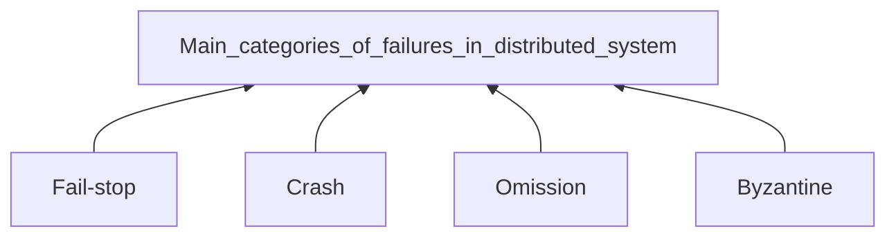
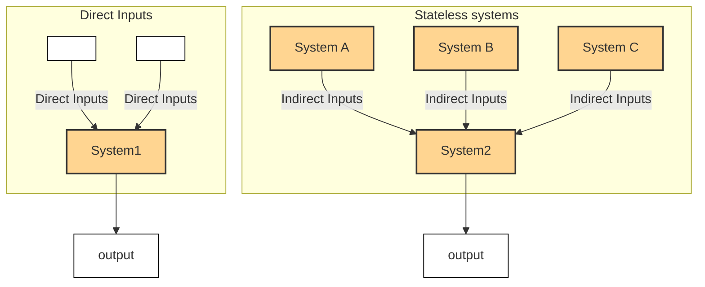

[Educative.io Resource](https://www.educative.io/courses/distributed-systems-practitioners/getting-started)
[[Must-learn in Distribution]]
# Introduction

>[!quote] A **distributed system** is a system whose components are located on different networked computers, which communicate and coordinate their actions by passing messages to one another.
>The components are the each **program** runs on a separate machine. We refer to each of these machines as a **node**. These components take many forms; e.g., they can be web servers, routers, web browsers, etc.
>
>![[Distributed system-20240714130635829.webp|529]]

## Parts of a distributed system

1. The various parts that compose a distributed system, which are located remotely and are separated by a network
2. The network that separates the various parts: It acts as a communication mechanism that lets them exchange messages

## Benefits of Distributed System

All Benefits come from comparing with a single computer system
### Performance

>[!summary] Performance is the degree to which a software system or component meets its objectives for timeliness(及时性目标).

>[!Warning|label] Problem with a single computer
>The physical constrains of its **hardware impose certain limits on the performance**. Moreover, it's extremely expensive to improve a single computer's performance.
>

>[!done|label] Solution
>We can achieve the same performance with two or more low-spec computers as with a single, high-end computer.
>So, distributed system allows us to achieve better performance at a low cost

### Scalability 可扩展性

>[!summary] Scalability is the capability of a system, network, or process to handle a growing amount of work, or its potential to be enlarged to accommodate that growth.

>[!Warning|label] Problem with a single computer
>Data Storage and processing are responsible for most of the value that software system impart in the real world.  A system that comprises a single computer can only scale up to a certain point.

>[!done|label] Solution
>split and store the data in multiple computers, and distribute the processing work.

### Availability 可用性

>[!Summary] Availability is the probability of a system to work as required, when required, during a mission.

>[!Warning|label] Problem with a single computer
Nowadays, most online services need to operate all the time. It would be infeasible to provide this kind of guarantee with a single computer.

>[!done|label] Solution
>**Redundancy** is one of the widely used mechanisms to achieve higher availability. It refers to storing data into multiple, redundant computers. So, when one computer fails, we can efficiently switch to another one. This way, we’ll prevent our customers from experiencing this failure.
> 

## Fallacies of Distributed System
1. **network is reliable**: may fail
2. **latency is zero**: remote calls take longer than local calls
3. **bandwidth is infinite**: even though it has been improved, that doesn't mean we can use all of it
4. **network is secure**: the wider network used by two nodes to communicate is not necessarily under their control
5. **topology doesn't change**: different organizations may manage with different hardware; failures in some parts of this network may require us to change its topology to keep it functional. This also highlights the other two fallacies:
	1.  **there is one administrator**
	2. **the network is homogeneous**
6. **Transport cost is zero**
7. **The global clock fallacy**: every node in the system has its **own local clock** that runs at a unique rate

## Difficulties Designing Distributed Systems

>[!Important] Why distributed systems are hard to design?
>##### Properties that make distributed system challenging
>```mermaid
>graph BT
>Network_Asynchrony --> Properties_of_Distributed_Systems
>Partial_Failures --> Properties_of_Distributed_Systems
>Concurrency --> Properties_of_Distributed_Systems
>```

### Network Asynchrony 网络异步
**Network asynchrony** is a property of communication networks that ==cannot provide strong guarantees around delivering events, e.g., a maximum amount of time a message requires for delivery==. They may even deliver out of order—or not at all.

### Partial Failures
**Partial failures** are the cases where only some components of a distributed system fail. It **introduces significant complexity when it requires atomicity across components** in a distributed system. Thus, we must ensure that we either apply an operation to all the nodes of a system, or to none of them.

### Concurrency
**Concurrency** is the execution of **multiple computations at the same time**, and **potentially on the same piece of data.** These computations **interleave** with each other. This introduces additional complexity since these computations can **interfere with each other and create unexpected behaviors**.

## Measures of Correctness in Distributed Systems

### Correctness & Measures of Correctness
We can define the correctness of a system in terms of the **properties it must satisfy**:
1. **Safety** property: defines something that **must never happen** in a correct system
2. **Liveness** property(有效性): defines something that **must eventually happen** in a correct system.
>[!example] Example of A Correct System: oven
>**Safety**: the oven must never exceeds a maximum temperature threshold
>**Liveness**: the oven must eventually reaching the temperature we specified via the button

### Inherent tension between safety and liveness properties
There are some problems that make it physically impossible to satisfy both kinds of properties. So, we need to compromise some liveness properties to maintain safety.

## Distributed System Models

### Nature of real-life distributed systems

**Real-life distributed systems can differ drastically** in many dimensions, these differences depend on factors like the network that deploys them, the hardware they run on, etc.

Thus, **we need a common framework** to solve problems generically. This way, we don’t need to repeat the reasoning for the different variations of these systems.

### Making a generic model

To create a model of a distributed system, we must **define several properties it must satisfy**. If we prove **an algorithm is correct for this model, we can be sure that it’ll also be correct for all the systems that satisfy these properties**.

### ==Properties each system follows==

The main important properties in a distributed system concern the following:
- ==How the **nodes** of a distributed system **interact with each other**==
- ==How the **nodes** of a distributed system **can fail**==

### Categories of Distributed System

There are two main categories of distributed systems that depend on the nature of communication:

#### 1. ==Synchronous systems 同步系统==

Where **each node has an accurate clock**, and there is a **known upper bound on the message transmission delay and processing time**.
As a result, the execution splits into rounds(执行被分成若干轮). This way, every node sends a message to another, the messages deliver, and **every node computes based on the message it receives**. During this, all nodes run in lock-step(按部就班).

#### 2. ==Asynchronous systems 异步系统==

Where there is no fixed upper bound on how long it takes for a node to deliver a message, or how much time elapses between consecutive steps of a node. The system nodes do not have a common notion of time and, thus, run at independent rates

## Types of Failures



### Fail-stop
A node **halts** and remains halted permanently. **Other** nodes **can detect** that node has failed(by **communicating** with it)

### Crash
A node **halts**, but **silently**. So other nodes may **not be able to detect** this state. They **can only assume its failure when they unable to communicate with it**.

### Omission 疏忽
A node **fails to respond** to incoming requests.

### Byzantine
A node exhibits **arbitrary behavior**: it may transmit arbitrary messages at arbitrary times, take incorrect steps, or stop. This usually happens when a **malicious(恶意) actor** or a **software bug compromises the node**.

## The Tale of Exact-Once Semantics(Processing)

### Multiple deliveries of a message

As the network is not reliable, these messages might get lost. Can lead to common **delivery semantics**:
- **At-most-once delivery**: sender sends every message only one time, no matter what happens
- **At-least-once delivery**: keeps sending until we get an acknowledgement from the recipient.

#### Consequence
Multiple deliveries might lead to multiple processing on recipient side, can create disastrous side effects. such as charge a customer twice.

### Avoiding multiple deliveries of a message

#### 1. Idempotent operations approach.

>[!Definition] **Idempotent** is an operation we can apply multiple times without changing the result beyond the initial application.
>

*An example of an idempotent operation is to add a value in a set of values. Even if we apply this operation multiple times, the operations that run after the first will have no effect, since the value will already be added to the set. Of course, we assume here that other operations cannot remove values from the set. Otherwise, the retried operation may add a value that was removed.*

**So multiple deliveries -> multiple Idempotent operations(Processing) -> result correct**
##### Tight Constrains make it hard to make all operations idempotent

============
#### 2. De-duplication approach

>[!Definition]
>1. Every message has a **unique identifier**
>2. Every **retried message** contains the **same identifier as the original**
>3. **Recipient** can **remember** the set of **identifiers** it received and **executed already**

>[!Warning] Constrains:
>We must have control on both sides of the system: sender and receiver. Because the **ID generation occurs on the sender side**, but the **de-duplication process occurs on the receiver side**.

#### Difference between delivery and processing

- let’s consider **delivery** to be the arrival of the message at the destination node, at the hardware level.
- Then, we consider **processing** to be the handling of this message from the software application layer of the node.

In most cases, ==we care more about how many times a node processes a message, than about how many times it delivers it==

>[!Summary] it’s impossible to have _exactly-once delivery_ in a distributed system. However, it’s still sometimes possible to have _exactly-once processing._

## Failure detector -- Timeout

>[!Background]
As mentioned above, One reason for failure is that the **asynchronous nature of the network** in a distributed system can make it **very hard for us to differentiate between a crashed node and a node that is just really slow to respond** to requests.

>[!quote]  
>**Timeouts** is the **main mechanism** we can use to **detect failures** in distributed systems. Since an asynchronous network can infinitely delay messages, **timeouts impose an artificial upper bound on these delays**. As a result, we can **assume that a node fails when it is slower than this bound**. This is useful because otherwise, the assumption that the nodes are extremely slow would block the system that is waiting for the nodes that crashed.

### Trade-off for the small timeout value

- System will waste less time waiting for the nodes have crashed
- **==False Positive==**: might declare some nodes that have not been crashed dead, while they are actually just a bit slower than expected.
	- **Impact**: can lead to **unnecessary recovery actions**, such as restarting the node or reassigning tasks, which can waste resources and potentially disrupt the system.

### Trade-off for the large timeout value

* System will be lenient(宽松) with slow nodes
* System will be slower in identifying crashed nodes, in some cases wasting time while waiting for them.
* **==False Negative==**: fails to identify a failed node, incorrectly assuming that the node is still functioning.
	![[Distributed system-20240714165217619.webp]]

### Summary of the Terms
>[!Caution] 
>- **False Positive**: Incorrectly marking a healthy node as failed.
>- **False Negative**: Incorrectly marking a failed node as healthy.
>- **True Positive**: Correctly identifying a failed node as failed.
>- **True Negative**: Correctly identifying a healthy node as healthy.


### Failure Detector
A Failure Detector is the component of a node that we can use to identify other nodes that have failed.

#### Properties that categorize failure detectors
Through two basic properties that reflect trade-off:
1. **Completeness**: corresponds to the **percentages** of **crashed** nodes a failure detector **successfully identifies** in a certain period (TP + TN)
2. **Accuracy**: corresponds to the **number of mistakes** a failure detector makes in a certain period(FP + FT)

## Stateless and Stateful Systems

### Stateless System
>[!Definition] Stateless System maintains no state of what happened in the past and performs its capabilities purely based on the inputs we provide to it.

- **Direct inputs** are inputs that are included **in the request**, 
- **indirect inputs** are inputs that are **potentially received from other systems** to fulfill the request.

### Stateful Systems
>[!Definition] Stateful systems are responsible for maintaining and mutating a state. Their results depend on this state.
![[Distributed system-20240714191647083.webp|301]]

* **Stateful Systems are beneficial in** real life since computers are much more capable than humans of **storing and processing data**.
* **Maintaining state involves additional complexity**. For instance, we much decide the most efficient **way to store and process it**, how to **perform back-ups**, etc.
* As a result, we'd **better create an architecture that contains clear boundaries between ==stateless components(which perform business capabilities)== and ==stateful components(which handle data)==**  

### Benefits of Stateless Over Stateful Systems

1. **Stateless distributed systems** are much easier to design, build and scale. The main reason for this, it's **easier to balance traffic between stateless nodes(servers)** and **scale by adding or removing servers**.
2. **Stateful system present more challenges**: As difference nodes may hold **different pieces of data**, they require **additional work to direct traffic to the right place**, and **ensure each instance is in sync with others**.

# Basic Concepts and Theorems

## Partitioning -- for Scalability and performance

>[!Important] One of the primary mechanisms of achieving **scalability** is **partitioning**.
>Scalability lets us store and process datasets much larger than what we could with a single machine.

>[!Definition]
>Partitioning is **the process of splitting a dataset into multiple, smaller datasets**, and then **assigning the responsibility of storing and processing them into different nodes**.
>
>This **allows** us to **add more nodes** to our system and **increase the size of data** it can handle

### Two Different Variations of Partitioning
![[Distributed system-20240714195603798.webp]]
#### 1. Vertical Partitioning

Each table contains **fewer columns** and **using additional tables to store columns that relate rows across tables.** We commonly refer to this as a **==join== operation**. We can then store these different tables in different nodes.

[**Normalization**](https://en.wikipedia.org/wiki/Database_normalization) is one way to perform vertical partitioning. However, general vertical partitioning goes far beyond that: it splits a column, even when they are normalized.

>[!Warning] Limitation
>
>==Need to combine data from different tables (i.e., join operations) become less efficient==. This is because these requests may now **have to access data from multiple nodes**.

#### ==2. Horizontal Partitioning(or **sharding**)==

**Each table contains a percentage of the initial table’s rows**. We can then store these different sub tables in different nodes.

**A simplistic approach for this is an alphabetical split**. For instance, we can horizontally partition a table that contains the students of a school by using the students’ surnames. The following illustration shows how.

>[!Warning] Limitation
>1. We can usually avoid accessing data from multiple nodes because all the data for **each row is located in the same node**. **However**, we **may still need to access data from multiple nodes** for requests that are ==searching for a range of rows that belong to multiple nodes==.
>
>2. Another important implication of horizontal partitioning is the ==potential for loss of transactional semantics(ACID)==.
>   When we store data **in a single machine**, we can **easily perform multiple operations in an atomic way**, where either _all_ or _none_ of them succeed. However, this is much harder to achieve in a distributed system.
>   
>   As a result, it’s much **harder to perform atomic operation**s—when partitioning data horizontally—over **data that resides in different nodes**.

## Algorithms for Horizontal Partitioning

### ==Range== partitioning

>[!Definition]
Splitting a dataset into ranges according to the value to a specific attribute. Storing each range in a separate node. For example, with the alphabetical split on Last Name Attribute.
![[Distributed system-20240714201732374.webp]]
#### Advantages

1. **Simplicity and ease of implementation**.
2. **Able** to perform **range queries** that ==using partitioning key value==
3. **Good performance of range queries** that **use partitioning key**, ==when queried range is small and reside in a single node==
4. ==Makes adjusting ranges (**repartitioning**) easier and more efficient==. **One range can be increased and decreased, which exchanged data only between two nodes**.
#### Disadvantages

1. **Inability** to perform **range queries using keys other than the partitioning key**
2. **Bad performance** for range queries that use partitioning key when **the queried range is big and resides in multiple nodes.**
3. An ==uneven distribution of traffic or data==, which causes some nodes to overload. This means some nodes may have to store more data and process more requests than others.

### ==Hash== partitioning

>[!Definition]
> We apply **a hash function to a specific attribute of each row**. This results in a **number that determines which partition-and, thus, node-this belongs to**.
> $$hash(the partitioning attribute) \mod #nodes$$
> **This mapping process will take place both** when we **write a new record** and when receive a request to **find a record for a specific value of this attribute**
> 
> ![[Distributed system-20240714202934910.webp]]
> 
> Suppose Node3 dead, Repartition:
> ![[Distributed system-20240714203335747.webp]]
 
#### Advantages of hash partitioning

1. ==The ability to calculate the partitioning mapping at runtime== with **no need to store, maintain and query the mapping**. ==Beneficial for both data storage and performance==.
2. A greater chance that **the hash function will uniformly distribute the data** across nodes, and ==prevent some nodes from overloading== 
#### Disadvantages of hash partitioning

1. The ==inability to perform range queries at all==
2. **Adding, removing nodes causes ==repartition==**. It ==results in significant data movement across all nodes of the system==

### ==Consistent== hashing

>[!Definition]
>Very **similar to hash partitioning,** ==but solves the increased data movement problem caused by hash partitioning==.
>
>1. ==Each node== in the system is ==randomly assigned an integer in a range of `[0, L]`==. This range is called ==ring== (for example, `[0, 360]`). 
>2. Then, the system uses a record with an attribute value `s` as a partitioning key to locating the node after the point ==`hash(s) mod L`== in the ring. 
>3. We ==assign each key to the node that is the next one after the mod value==
>
>![[Distributed system-20240714204950684.webp]]
#### Advantages

1. Reduced data movement when nodes are added or removed
#### Disadvantages

1. ==The Potential for data' nonuniform distribution== because of the **random assignment of nodes in the ring**
2. The Potential for ==more imbalanced data distribution as nodes are added or removed==. E.g. data distribution is already uneven, and **when you remove an overloading node, it transfers all the data to the next single node in the rang**.

---

## Replication -- for Availability

>[!Background]
>Availability refers to the ability of the system to remain functional despite failures in parts of it.

>[!Definition]
>It consists of ==storing the same piece of data in multiple nodes (called **replicas**)== so that if one of them crashes, data is not lost, and requests can be served from the other nodes in the meanwhile.

### Complications(并发症) come with replications

Replication implies that the system now has multiple copies of every piece of data. ==These copies must be maintained and kept in sync with each other on every update==.

*Ideally, **replication should function transparently to the end user,** or engineer. This is to create the illusion that there’s only one copy of every piece of data. This makes a distributed system look like a simple, centralized system of a single node that is much easier to reason about and develop software around.*

However, this is not always possible since it may requires significant hardware resources大量的硬件资源 or give up other desirable properties to achieve this deal.

Therefore, there are two main strategies for replication:

1. Pessimistic replication
2. Optimistic replication

### Pessimistic Replication 悲观复制

**Pessimistic replication** ==tries to guarantee== from the beginning that ==all the replicas are identical to each other==—as if there was only one copy of the data all along.
### Optimistic Replication 乐观复制

**Optimistic replication**, or ==lazy replication==, ==allows the different replicas to diverge==. ==This guarantees that they will converge again if the system does not receive any updates, or enters a quiesced state宕机状态, for a period of time.==

## Primary-Backup Replication Algorithm

>[!Definition]
>Primary-backup replication is a technique where we **designate a single node** amongst the replicas as the **leader**, or primary, that receives all the updates.
>
>> This technique is also known as **single-master replication**.
>
>We commonly refer to the remaining replicas as ==**followers** or secondaries, which can **only handle read requests**==. Every time the ==**leader receives an update(write)**, it **executes it locally** and also **propagates** the update to the other nodes==. This **ensures that all the replicas maintain a consistent view** of the data.
> ![[Distributed system-20240714211605722.webp]]

### Two propagation ways

#### 1. Synchronous replication
![[Distributed system-20240714211922409.webp]]

>[!Definition]
>In **synchronous replication**, ==the node replies to the client to indicate the update is complete==—**only after receiving acknowledgments from the other replicas that they’ve also performed the update on their local storage**.

 This **guarantees the client is able to view the update** in a subsequent 后续的 read **after acknowledging it**, no matter which replica the client reads from.
 
Furthermore, synchronous replication provides increased **==durability==**. This is because **the update is not lost even if the leader crashes right after it acknowledges the update.**

However, this technique can **make ==writing requests slower==**. This is because the leader has to wait until it receives responses from all the replicas.

#### 2. Asynchronous replication
![[Distributed system-20240714212345377.webp]]

>[!Definition] 
>In **asynchronous replication**, the **node(leader) replies to the client as soon as it performs the update in its local storage**, **without waiting** for responses from the **other replicas.**

This technique ==increases performance significantly for write requests==. This is because **the client no longer pays the penalty of the network requests to the other replicas.**

However, this comes at the ==cost of reduced consistency and decreased **durability**==. After a client receives a response for an update request, **the client might read older (stale) values** in a subsequent read. This is only possible if the operation happens in one of the replicas that have not yet performed the update. Moreover, **if the leader node crashes right after it acknowledges an update, and the propagation requests to the other replicas are lost, any acknowledged update is eventually lost**.

### Failover 切换leader

>[!Definition]
>**Failover** is when the **leader node crashes and a follower node takes over**.
>
>![[Distributed system-20240714213721448.webp|487]]![[Distributed system-20240714213739243.webp|544]]

#### Two approaches to perform a failover: **manual** and **automated**.

##### Manual approach

In the manual approach, the **operator selects the new leader node** and instructs all the nodes accordingly. This is the ==safest approach, but it incurs significant downtime==.

##### Automated approach

An alternative is an automated approach, ==where follower nodes detect that the leader node has crashed (e.g., via **periodic heartbeats**)==, and ==attempt to elect a new leader node==. This is **faster but is quite risky**. This is **because there are many different ways in which the nodes can get confused and arrive at an incorrect state**.

### Advantages of primary-backup replication

1. It is ==simple to understand and implement==
2. Concurrent operations serialized并发序列号操作(update) in the leader node ==remove the need for more complicated, distributed concurrency protocols==. In general, this property also makes it **easier to support transactional operations**
3. It is ==scalable for read-heavy workloads== because the **capacity for reading requests can be increased by adding more read replicas**

### Disadvantages of primary-backup replication

1. It is ==not very scalable for write-heavy workloads== because a **single node’s capacity (the leader’s capacity) determines the capacity for write**s
2. It imposes an ==obvious trade-off between performance, durability, and consistency====
3. Scaling扩充 the read capacity by adding more follower nodes== can create ==a bottleneck in the network bandwidth of the leader node==, **if there’s a large number of followers listening for updates**
4. **The process of failing over 切换到 to a follower node when the leader node crashes is not instant**. This ==may create some downtime and also introduce the risk of errors==

## Multi-Primary Replication Algorithm

>[!Important]
>Primary-backup replication can easily support transactions and hide the distributed nature of the underlying system, i.e., when using synchronous replication.
>
>However, primary-backup replication has some limitations in terms of performance, scalability, and availability
>
>==There are many applications where **availability** and **performance** are much **more important than** data **consistency** or **transactional semantics**.==

>[!example] e-commerce shopping cart
> Where the **most important thing** is for customers to be **able to access their cart at all times** and **add items quickly and easily**. It is **acceptable to compromise consistency** to achieve this, **as long as there is data reconciliation核对 at some point**.
> 
> For instance, if two replicas **diverge because of intermittent(occasionally) failures**, the customer **can still resolve conflicts during the checkout process**.

>[!definition]
>**Multi-primary replication** is an alternative replication technique that favors higher availability and performance over data consistency.
>> Also known as multi-master replication
>
>**All replicas are equal and can accept write requests.** **They are also responsible for propagating the data modifications to the rest of the group.**
>
>- **Differences with Primary-Backup Replication**: there is **no single leader node that serializes the requests and imposes a single order,** as ==write requests are concurrently handled by all the nodes==. This means that ==nodes might disagree on what is the right order for some requests. We usually refer to this as a **conflict**.==
>

### Conflict resolution
>[!Background]
>For为了 the system to remain operational, the nodes need to resolve this conflict when it occurs by agreeing on a single order顺序 from the available ones.

>[!example]
>1. Client had write `x=10` to `A` and `A` has propagated to `C`, yet not to `B`. 
>2. In this mean time, client write again `x = 14` to `B` 
>![[Distributed system-20240714215920786.webp]]
>3. `B` modifies locally and propagated to `A` and `C` successfully. Now `x = 14` is agreed by all nodes
>4. Finally, the propagation from `A` to `B` with info that `x = 10` arrives at `B`
>![[Distributed system-20240714220316062.webp]]
>5. We ended up like this:
>![[Distributed system-20240714220408357.webp]]
>
>**A subsequent read request could receive different results** depending on the node that handles the request

Here are some common approaches:
#### Exposing conflict resolution to the clients

**When there is a conflict, the multiple available versions return to the client**. The client then selects the right version and returns it to the system. This resolves the conflict.

#### Last-write-win conflict resolution

**E==ach node** in the system **tags each version with a timestamp**==, using ==a local clock==. During a conflict, the version with the latest timestamp is selected.

However, ==this technique **can lead to some unexpected behaviors**, as there is **no global notion of time**==. For example, Write B, which logically should be the final state, could be overridden by Write A due to timestamp discrepancies between nodes.

#### Causality tracking algorithms

The system uses an algorithm that ==keeps track of causal relationships between different requests==. When there is a conflict between two writes (A, B) and one is determined to be the cause of the other one (suppose A is the cause of B), then the resulting write (B) is retained.

However, there can s**till be writes that are not causally related, i.e., requests are actually concurrent.** In such cases, the system cannot make an easy decision.

It doesn’t typically involve assigning a single node to record all propagation. Instead, it’s more about **maintaining a version history or a vector clock that helps in understanding the sequence of operations and their dependencies,** thereby resolving conflicts without a single point of reference.

## Quorums in Distributed System

>[!Abstract] The problem in synchronous replication
>**Availability is quite low for write operations**, because the failure of a single node makes the system unable to process writes until the node recovers.

>[!Definition]
>In general, in a system that has 
>1. **a total of V replicas**
>2. every read operation should obtain a **read quorum of 𝑉𝑟​ replicas**. 
>3. Meanwhile, a write operation should **obtain a write quorum of 𝑉𝑤​ replicas**. 
>4. The **values of these quorums should obey** the following properties:
> 	  1. **𝑉𝑟 + 𝑉𝑤 > 𝑉**
> 	  2. **𝑉𝑤 > 𝑉/2**

### The First Rule Promises:

- **Overlap of Quorums:** ==Guarantees that read and write operations intersect at some replica==, ==ensuring that reads reflect the most recent writes==.
- **Preventing Concurrent Issues:** **By ensuring that reads and writes overlap**, ==concurrent read and write operations on the same data cannot independently proceed without affecting each other, thus maintaining data consistency and atomicity.==

### The Second Rule Promises:

* This rule ensures that **every write operation involves a majority of replica**s, ==which helps in maintaining order and consistency of writes.==

## Safety Guarantee In Distributed Systems 

### Safety guarantors

![[Distributed system-20240715153738991.webp|531]]

The concepts of **atomicity** and **isolation** originate from database research and ACID transactions. When we mention **consistency** in this course, we will mostly refer to the notion of consistency made popular by the CAP theorem.

### Achieving atomicity

>[!Warning] It is challenging to achieve atomicity in a distributed system because of the possibility of **partial failures**.

### Achieving consistency

>[!Warning] It is challenging to achieve consistency because of the **network asynchrony**.
>Network asynchrony happens when different nodes in a network have different values for the current time.

### Achieving isolation

>[!Warning] It is challenging to achieve isolation because of the inherent concurrency固有的并发性 of distributed systems.
>Concurrency occurs when multiple things happen at the same time.

## ACID Transactions

>[!Background]
>**ACID** is a set of properties of traditional database transactions that provide guarantees around the expected behavior of transactions during errors, power failures, etc.

### Atomicity (A)

>[!Definition] Atomicity guarantees that a transaction that comprises包含 multiple operations is treated as a single unit.
>
>This means that either *all* operations of the transaction are executed or *none* of them are.
>
>This concept of atomicity extends to distributed systems, the system **might need to execute the same operation in multiple nodes of the system in an atomic way. So, the operation is either executed to all the nodes or none**.

### Consistency (C)

>[!Definition] Consistency guarantees that a transaction only transitions the database from one valid state to another valid state, while maintaining any database invariants数据库的不变性. However, these invariants are application-specific and defined by every application accordingly. 

>[!example]
>For example, consider an application that has a table A with records that refer to records in table B through a [foreign key relationship](https://en.wikipedia.org/wiki/Foreign_key). The database prevents a transaction from deleting a record from table A, unless any records in table B referenced from this record are already deleted.

>[!Warning] Consistency in Transactions is different from consistency in Distributed System

### Isolation (I)

>[!Definition] **Isolation** guarantees that even though transactions **might run concurrently** and have data dependencies, **the result is as if one of them was executed at a time and there was no interference between them**. This prevents a large number of anomalies.

### Durability (D)

>[!Definition] **Durability** guarantees that once a transaction is committed, it **remains committed even in the case of failure**.

In the context of single-node, centralized systems, this usually means that completed transactions and their effects are recorded in non-volatile storage(**persistent storage**).

In the context of distributed systems, this means that ==**transactions need to be durably stored in multiple nodes**==. This way, **recovery is possible even in the presence of total failures of a node, alongside its storage facilities.**

## The CAP Theorem
It outlines an *inherent trade-off in the design* of distributed systems.

### Initial statement of the CAP theorem

>[!Warning]
>According to the initial statement, it's *impossible* for distributed system data store to provide more than *two of three properties simultaneously*: **consistency**, **availability** and **partition tolerance**

#### Consistency
Consistency means that every successful ==read request== receives the result of t==he most recent write request==.

>[!Important] The concept of consistency in the CAP theorem is completely different from the concept of consistency in ACID transactions. 
>**The notion of consistency as presented in the CAP theorem is more important** for distributed systems.

### Availability

Availability means that ==every request receives a non-error response==, **without any guarantees on whether it reflects the most recent write request.**

### Partition Tolerance

Partition tolerance means that ==the system can continue to operate despite an arbitrary number of messages being dropped by the network between nodes due to a **network partition**.==

>[!Important] It is very important to understand that _partition tolerance_ is not a property we can abandon.

In a distributed system, there is always the risk of a network partition. If this happens, the system **needs to decide either** to ==continue operating and compromise妥协 _data consistency_==, or ==stop operating and compromise _availability_==.

However, there is no such thing as trading off _partition tolerance_ to maintain both _consistency_ and _availability_. As a result, what this theorem really states is the following.

### Final statement of the CAP theorem

>[!Definition] A distribute system can be either consistent or available in the presence of a network partition

#### Proof
![[Distributed system-20240715161711086.webp|482]]
There is a *network failure* that results in a network partition between the two nodes of the system at some point.

We will examine the case where a different node of the system processes each operation. In that case, the system has **==two options==**:

#### Trade-off Methods:

>[!important] 
>1. It can **fail one of the operations**, and ==break the _availability_ property==.
>2. It can **process both the operations**, which will ==return a stale value from the read and break the _consistency_ property.==

### Importance of the CAP Theorem

>It helped establish the basic limitations of all distributed systems.
>
>The CAP theorem forces designers of distributed systems to make explicit trade-offs between _availability_ and _consistency_. Once the engineers become aware of these properties, they choose the appropriate system.

### Categorization of distributed systems based on the CAP theorem
![[Distributed system-20240715162220771.webp|722]]
>[!caution] There is another important thing to note about the CAP theorem: the choice between _consistency_ and _availability_ needs to be made _only_ during a network partition.
>Both _consistency_ and _availability_ properties can be satisfied when the network partition is not present.

## Trade-off between latency and consistency

>[!hint] When no network partition is present during normal operation, there’s a different trade-off between _latency_ and _consistency_.
>To guarantee _**data consistency**_, the system will have to **delay write operations until the data has been propagated** across the system successfully, thus taking a **_latency_** hit.

>[!example]
>An example of this trade-off is the **primary-backup** replication scheme. In this setting, the **_synchronous replication_** approach would **favor _consistency_ over _latency_**. Meanwhile, **_asynchronous replication_** would **reduce _latency_ at the cost of _consistency_**.

### PACELC Theorem

The **PACELC theorem** is an extension of the CAP theorem that is captured in a separate article. It states the following:

>[!quote] “In the case of a _network partition_ (P), the system has to choose between _availability_ (A) and _consistency_ (C) but _else_ (E), when the system operates normally in the absence of network partitions, the system has to choose between _latency_ (L) and _consistency_ (C).”

#### Categorization of Distributed Systems based on PACELC theorem

Each branch of the PACELC theorem creates two sub-categories of systems.

The **first** part of the theorem defines the two categories we have already seen: **CP and AP**.

The **second** part defines two new categories: **EL** and **EC**.

>[!Tip] These sub-categories are combined to form the following four categories:
>- AP/EL
>- CP/EL
>- AP/EC
>- CP/EC

A system from the AP/EL category prioritizes _availability_ during a network partition and _latency_ during a normal operation.
Usually either ==performance and availability==, **or** ==data consistency==. As a result, ==most of the systems fall into the AP/EL or CP/EC categories.==

"Eventually consistent" means prioritize other over consistency.
## Fundamental Consistency Models

>[!check] Consistency models are extremely useful for many reasons:
>1. They help us **formalize the behaviors of systems**. Systems can then provide **guarantees** about their behavior.
>2. Software engineers can **confidently use a distributed system** (i.e., a distributed database) in a way that does not violate any safety properties they care about.

We consider consistency model A ==stronger== than model B when the first ==allows fewer histories==. Alternatively, we say model A makes ==more assumptions about or poses more restrictions on the system’s possible behaviors==.

>[!Hint] List of Consistency Models [from strongest to weakest]
>- Linearizability
>- Sequential Consistency
>- Causal Consistency
>- Eventual Consistency

### Linearizability
>[!Definition]
>operations appear to be **instantaneous** to the external client. This means that they happen at **a specific point—from the point the client invokes the operation to the point the client receives the acknowledgment by the system the operation has been completed**.
>
>Furthermore, **once an operation is complete and the acknowledgment is delivered to the client, it is visible to all other clients**.

>[!caution]
>In a centralized system, linearizability is obvious.
>But in Distributed System: 
>	- linearizability is true in _synchronous replication_ system.
>	- in *Asynchronous replication*, **non-linearizability**
>![[Distributed system-20240716122709958.webp]]

>[!Tip] Benefits
>1. It helps us **treat complex distributed systems as much simpler, single-node data stores** and reason about 推理 our applications more efficiently.
>2. Moreover, by leveraging利用 atomic instructions provided by hardware(CAS operations) -> we can build more sophisticated logic on the top of distributed system

### Sequential Consistency

>[!Definition]
>Operations are ==allowed to take effect before their invocation or after their completion.==
>
>As a result, it provides **no real-time guarantees**. However, Operations from different clients have to be seen in the same order by all other clients, and ==operations of every single client preserve the order specified by its program (in this global order).== This allows **many more histories than linearizability** but still poses some constraints that can help real-life applications.
![[Distributed system-20240716133418316.webp]]
_It's OK that observers receive "Post(Y)" before "Post(X)", 
but it's not OK with observing wrong orders of operations from the same client_

### Causal Consistency

>[!Definition]
>In some cases, we **don’t need to preserve the ordering specified by each client’s program**—as long as causally related operations are displayed in the right order. 
>
>>This is the **causal consistency** model, which requires that ==only operations that are causally related need to be seen in the same order by all the nodes==.
>
>the operations that are **not causally related can be seen in different orders** in the various clients of the system **without the need to maintain the order of each client’s program**. Of course, to achieve that, ==each operation needs to contain some information that signals whether it depends on other operations or not(**notion of cause-and-effect**)==. This does **not need to be related to time and can be an application-specific property**.
![[Distributed system-20240716151307000.webp]]

### Eventual Consistency

>[!Definition] 
>It is one of the weakest forms of consistency since it does **not really provide any guarantees around the perceived order** of operations **or the final state the system converges to**.
>
>The order of operations can be different between the multiple clients of the system and **reads do not need to return the latest** write as long as the system eventually arrives at a stable state. In this state, **if no more write operations are performed, read operations will return the same result**. This is the model of eventual consistency.
>
![[Distributed system-20240716151724901.webp]]


## CAP Theorem's Consistency Model

>[!Tldr] The "C" property in the CAP theorem refers to the **linearizability** model.
>This means it's ***impossible*** to build a system that will be ***available*** during a network partition while also being ***linearizable***
>
>In fact, ***even some weaker forms of consistency***, such as sequential consistency, **cannot be supported in tandem wit availability under a network partition**.
### Categorization of consistency models

The CAP theorem can conceptually draw a line between all these consistency models and separate them into two major categories:
#### 1. Strong consistency models

>[!Definition] Strong consistency models correspond to the “C” in the CAP theorem and cannot be supported in systems that need to be _available_ during _network partitions_.

#### 2. Weak consistency models

>[!Definition] Weak consistency models are the ones that can be supported while also preserving _availability_ during a network partition.

### Two Commonly supported consistency models

>[!hint]
>- Strong consistency, specifically _linearizability_
>- Weak consistency, specifically _eventual consistency_

>[!attention] Reason
>* **Linearizability** : because a system needs to ==give up availability as part of the CAP theorem to support a strong consistency model==. It then seems reasonable to provide the strongest model amongst the available ones,
>* **Eventual Consistency**: thanks to its ==simplicity and performance==
>  Along the same lines, given由于 the application relinquishes放弃 the strict guarantees of strong consistency强一致性保障 for increased performance为了提升性能, it might as well **accept那同样也能接受 the weakest guarantees possible to get the biggest performance boost it can 为了最强性能接受最弱一致性**. This makes it **much easier for people to design and build applications on top of distributed systems**, and to decide which side of the CAP theorem they prefer to build their application on.


## Isolation Levels and Anomalies异常

>[!Background]
>The inherent concurrency creates the potential for anomalies and unexpected behaviors.
>
>**Specifically, transactions that comprise multiple operations and run concurrently can lead to different results depending on how their operations are interleaved.**

>[!Definition] As a result, there is still a need for some formal models that **define what is possible and what is not in a system’s behavior**. These are called **isolation levels**.

### Isolation Levels:

We will study the most common ones here, which are the following:

1. **Serializability:** It essentially states that two transactions, when executed concurrently, *should give the same result as though executed sequentially*.
   
2. **Repeatable read:** It ensures that the data *once read by a transaction will not change throughout its course过程*.
    
3. **Snapshot isolation:** It guarantees that all reads made in a transaction will see a consistent snapshot of the database from the point it started 所有读取都能看到数据库从开始时起的一致快照 , and the transaction will *successfully commit if no other transaction has updated the same data since that snapshot*.
    
4. **Read committed:** It does *not allow transactions to read data that has not yet been committed* by another transaction.
    
5. **Read uncommitted:** It is the lowest isolation level and allows the transaction to *read uncommitted data by other transactions*.

>[!Warning] Stronger isolation levels prevent more anomalies at the cost of performance.

### Anomalies

#### Dirty Write -- overwrite the same data

>[!Definition] A **dirty write** occurs when **a transaction overwrites a value that was previously written by another transaction** that is still in-flight and has **not been committed yet**.
>![[Distributed system-20240716161853119.webp|604]]
>##### Implications:
>1. **violates the Integrity Constraints**
>2. **impossible** to automatically **rollback** to a previous image of the database

#### Dirty Read -- read uncommitted data

>[!Definition] A **dirty read** occurs when a transaction **reads a value** that has been written by **another transaction that has not yet been committed**.
>![[Distributed system-20240716170615185.webp]]
>##### Implications:
>The system might **make decisions depending on these values**, even though the **associated transactions might be rolled back subsequently**. Even in the case where these transactions eventually commit, though, this can still be a problem.
>##### Usages
>there are a few cases where allowing dirty reads can be useful if done with care. 
>1. One such case is to **generate a big aggregate report on a full table** **when** we can **tolerate some inaccuracies** on the numbers of the report.
>2. It can also be useful when we **troubleshoot an issue and want to inspect the state of the database in the middle of an ongoing transaction**.

#### Fuzzy or non-repeatable read -- read twice end up 2 values

>[!Definition] This occurs when a value is **retrieved twice during one transaction**(without being changed, *another transaction modifies the data*), and the **value is different**.
>![[Distributed system-20240716185828798.webp]]

#### Phantom Read predicated read

>[!Definition] This occurs when a transaction does a predicate-based(conditional) read, another transaction writes or removes a data item that matches the predicate(condition) while the first transaction is still in-flight, then the 1st transaction might be acting again on stale or inconsistent data 
> ![[Distributed system-20240716190549061.webp]]

#### Lost update -- write simultaneously, one survives, other lost

>[!Definition] Two transactions read the same value and try to **update it to two diff values simultaneously**. One of two updates survives, the process that is executing the other update is not informed that **lost update**.
>![[Distributed system-20240716190949495.webp]]
> it *might be safe to allow lost updates in some cases*. For example, consider an application that allows multiple administrators to update specific parts of an internal website used by employees of a company.

#### Read Skew -- two read results break integrity constrains

>[!Definition] This occurs when there are integrity constrains between two data items that seem to be violated because a transaction can only see partial results of an other transaction.
>
>>[!example] Suppose an integrity constrain: friendships are mutual, if add or remove a friend, friendship relationship should be updated on each person
>>![[Distributed system-20240716191615897.webp]]
>*A strict requirement to prevent read skew is quite rare, as we might have guessed already. For example, a common application of this type might **allow a user to view the profile of only one person at a time** along with their friends, thus not requiring the integrity constraint described above.*

#### Write Skew -- two write on disjoint of same data

>[!Definition] A **write skew** occurs when two transactions read the same data, but then **modify disjoint sets of data**.
>![[Distributed system-20240716191854492.webp]]


## Preventing of Anomalies in Isolation

### "Serializable" Prevents all of anomalies

>[!Important]
>It guarantees that the **result of** the execution of **concurrent transactions** is the **same as** that produced by some **serial execution of the same transactions**. 
>
>This means that we *can only* **analyze serial execution for defects 缺陷**. If all the possible serial executions are safe, then any concurrent execution by a sys that at the serializable level will be safe.

### ❓Other Isolation Levels

>[!tldr] Others are **less strict** and provide **better performance via increased concurrency** at the **cost of decreased safety**.

|                                       | **Dirty**<br><br>**Writes** | **Dirty**<br><br>**Reads** | **Fuzzy**<br><br>**Reads** | **Lost**<br><br>**Updates** | **Read**<br><br>**Skew** | **Write**<br><br>**Skew** | **Phantom**<br><br>**Reads** |
| ------------------------------------- | --------------------------- | -------------------------- | -------------------------- | --------------------------- | ------------------------ | ------------------------- | ---------------------------- |
| ==**Read**<br><br>**Uncommitted**==   | ==not<br><br>possible==     | possible                   | possible                   | possible                    | possible                 | possible                  | possible                     |
| ==**Read**<br><br>**Committed**==     | ==not<br><br>possible==     | ==not<br><br>possible==    | possible                   | possible                    | possible                 | possible                  | possible                     |
| ==**Snapshot**<br><br>**Isolation**== | ==not<br><br>possible==     | ==not<br><br>possible==    | ==not<br><br>possible==    | ==not<br><br>possible==     | ==not<br><br>possible==  | possible                  | possible                     |
| ==**Repeatable**<br><br>**Read**==    | ==not<br><br>possible==     | ==not<br><br>possible==    | ==not<br><br>possible==    | ==not<br><br>possible==     | ==not<br><br>possible==  | ==not<br><br>possible==   | possible                     |
| ==**Serializability**==               | ==not<br><br>possible==     | ==not<br><br>possible==    | ==not<br><br>possible==    | ==not<br><br>possible==     | ==not<br><br>possible==  | ==not<br><br>possible==   | ==not<br><br>possible==      |

## Consistency and Isolation

## Similarities between consistency models and isolation models

>[!Info] _Isolation levels_ and _consistency models_ are essential constructs that allow us to express:
>
>- Which executions are possible
>- Which executions are not possible

>[!Tip] In both cases, some of the models are stricter and allow fewer executions, thus providing increased _safety_ at the cost of reduced _performance_ and _availability_.
>
>For instance, _linearizability_ allows a subset of the executions _causal consistency_ allows, while _serializability_ allows a subset of the executions that _snapshot isolation_ allows.

>The fact that a system provides _linearizability_ automatically implies that the same system >also provides _causal consistency_.
>
>> Note that there are some models that are not directly comparable, which means neither of them is stricter than the other.

### Differences between consistency models & isolation levels

Differences with regards to the ==characteristics of their allowed and disallowed behaviors==.

- _Consistency models_ are applied to ==single-object operations== (e.g. read/write to a single register), while _isolation levels_ are applied to ==multi-object operations== (e.g. read and write from/to multiple rows in a table within a transaction).

> Looking at the strictest models in these two groups, _linearizability_ and _serializability_, there is another important difference.

- ==_Linearizability_ provides real-time guarantees, while _serializability_ does not.==

_Linearizability_ guarantees that the effects of an operation took place at some point between when the client invoked the operation, and when the result of the operation was returned to the client.

_Serializability_ ==only guarantees that the effects of multiple transactions will be the same as if they run in serial order==. It does **not** provide any **guarantee on** whether that serial order would be **compatible with real-time order**.

### Why real-time guarantees are important

![[Distributed system-20240716202248686.webp|491]]
Note that this execution is serializable (with the serial order of transactions T1, T3, and T2) and the end result is as if the machine executed the `GET_BALANCE()` transactions first, and then the `WITHDRAW(20)` transaction in a completely serial order.

This example shows how serializability is not sufficient in itself in some cases.

### Strict serializability

>[!Definition] **Strict serializability** is a model that is a combination of _linearizability_ and _serializability_.
>This model **guarantees** that the **result** of multiple transactions **is equivalent to** the **result of a serial execution of them, and is also compatible with the real-time ordering of these transactions**.

## Hierarchy of Models
![[Distributed system-20240716202607312.webp]]

## Why All the Formalities?

Understanding the models presented here is a good first step towards being more careful when we design systems, so we reduce the risk for errors. We should be willing to search the documentation of systems we want to use to understand what kind of guarantees they provide. Ideally, we should also be able to read between the lines and identify mistakes or incorrect usages of terms.