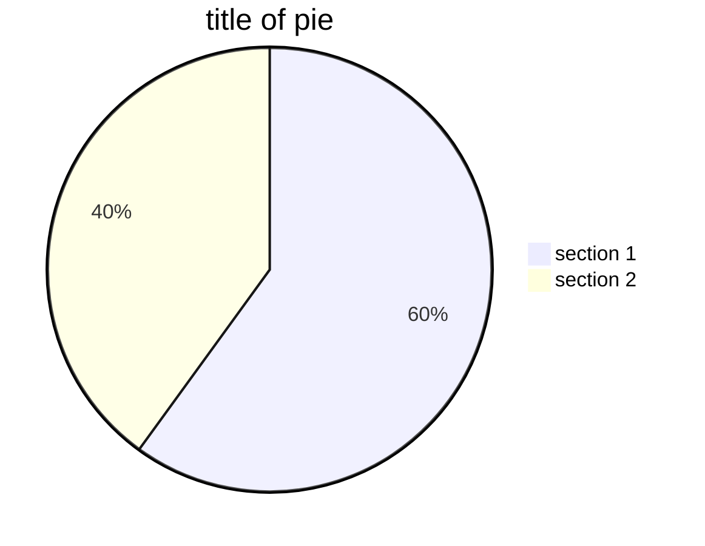
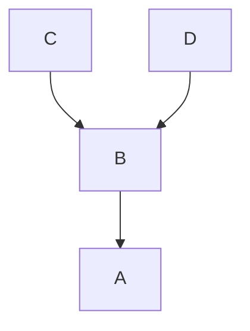
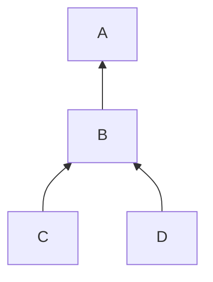
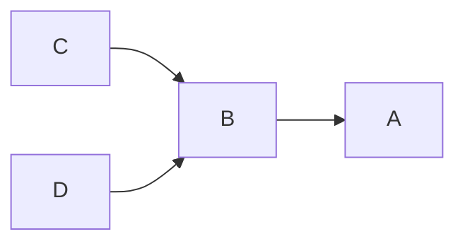
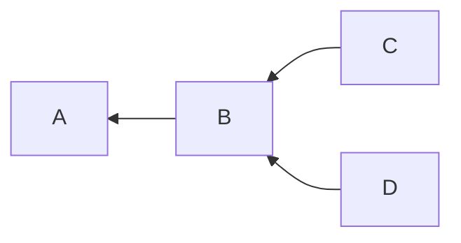

# Mermaid
[Basic](https://www.youtube.com/watch?v=rXhUeV5Ko7g)
## pie

```mermaid
pie title title of pie
"section 1": 60
"section 2": 40
```
## Graph

```mermaid
graph TD
B-->A
C-->B
D-->B
```
### Direction

1. Top to Bottom

```mermaid
graph TB
B-->A
C-->B
D-->B
```

2. Bottom to Top

```mermaid
graph BT
B-->A
C-->B
D-->B
```

3. Left to Right

```mermaid
graph LR
B-->A
C-->B
D-->B
```

4. Right to Left

```mermaid
graph RL
B-->A
C-->B
D-->B
```
